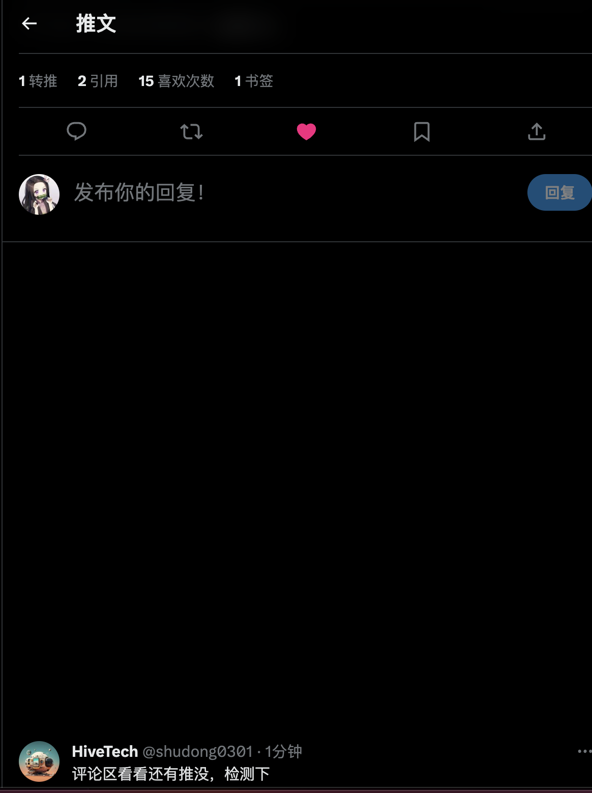
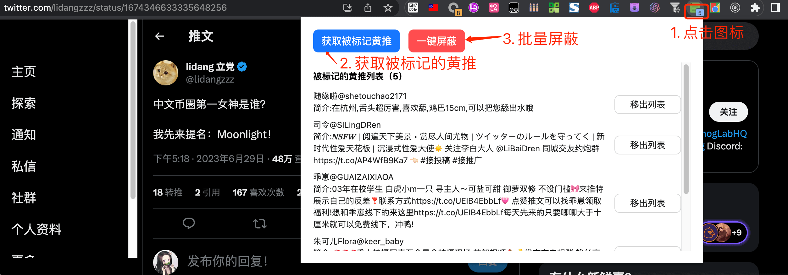
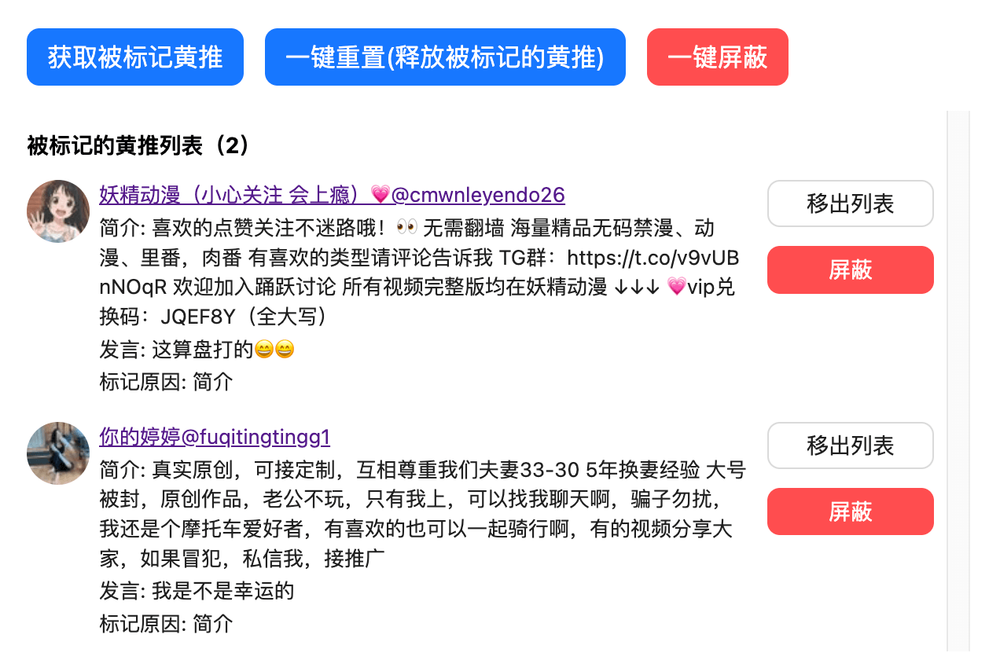

### 背景

实在受不了推文下无休无止的回复引流的黄推了，里面甚至涉及诈骗等灰产

### 设计宗旨

1. 隐私优先。本插件纯客户端代码，无服务端 api 或前端监控等设计

### 使用方式

1. 进入 [chrome://extensions/](chrome://extensions/)，打开「开发者模式」

2. 把代码包下载解压拖到里面即可

### 效果

目前一定得**自己装了插件才有用。且只针对推文回复下的黄推**。插件有 3 种功能。

1.标记推文回复下的黄推引流，并在自身浏览时隐藏

2. 一键批量屏蔽

3. 单个屏蔽

具体可以拿**立党**的推文 https://twitter.com/lidangzzz/status/1674952135690027010 检测下

### 说明

原理采用的是内置的「关键词匹配」检测是否是黄推，然后进行浏览器样式上的隐藏(非推特的 Block 功能)，准确率大约 90%。会有少少部分的错判和漏判。可以通过点击「移出列表」按钮加入白名单

### 后续计划

- [ ] 增加 on/off 配置
- [x] 增加一键 block 功能
- [ ] 适配 firefox 浏览器
- [ ] 进入 Store
- [ ] 其他

### 欢迎 PR
1. 想 PR 前，可以现在 discuss or issue 大概说下要做的内容

### License

MIT
